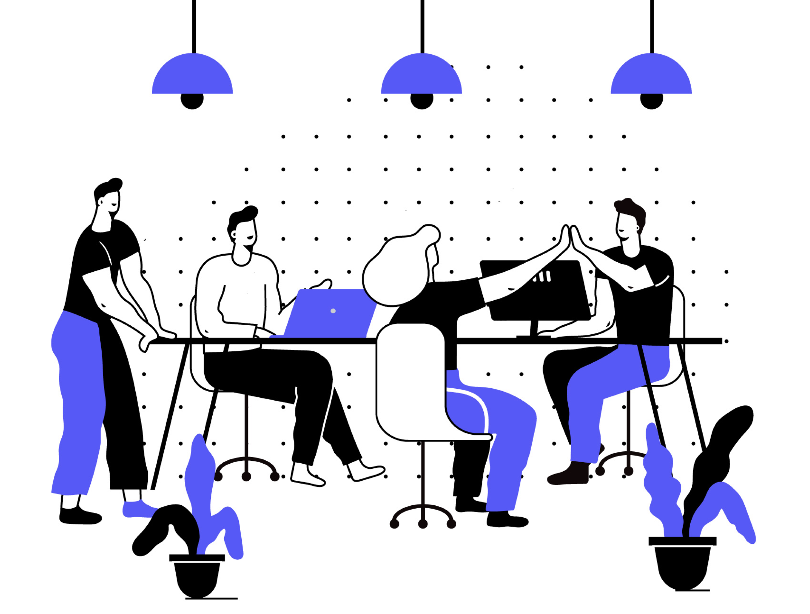
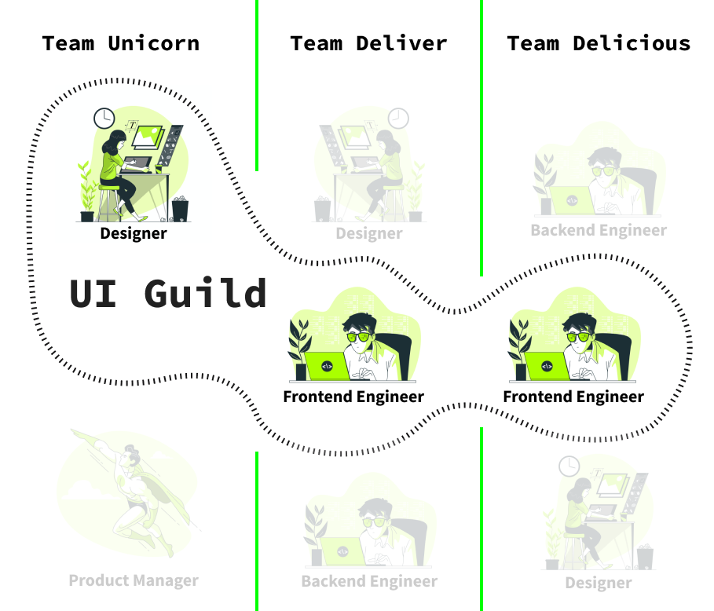

## Introduction

This guide will help **Frontend Engineers** and people from the **UI Community**
to develop a common understanding of **collaboration** and why this particular
skill can improve the process of software development and product design in your
company. I will **not** describe implementation details or how to create the
next big Design System. But I will provide you the right methods and practices
to build a Pattern Library or even a Design System. It will also help people who
already maintain a Pattern Library. To point out some problems and situations I
will do some _storytelling_. Let's get started.

## The Status Quo Story

Let’s imagine ourselves in a successful company with a customer-centric
application. The company has a **product department** with a bunch of
cross-functional teams. The product designers maintain a **design library** to
align the design files, which they share with **developers** and **managers**.
Besides that, the developers maintain a **pattern library**, which provides UI
components and variables for the code in the product. Let's take a closer look
at the roles:

### Designer

**Job Title:** Senior Product Designer

**Team:** Unicorn 🦄

**Current Task:** After a meeting with other product designers everyone agreed
to do small improvements to their design library. That person decided to update
the design files to a new shiny color palette to improve accessibility.

**Complication:** As soon as the designer updates the design library, we don’t
have an alignment with our Pattern Library anymore. 😢😢😢

### Developer

**Job Title:** Senior Frontend Engineer

**Team:** Delicious ✨

**Current Task:** Implementation of a new Product Teaser. That person recognized
some inconsistencies regarding the **colors** in the design file. It is not
aligned with the **pattern library**. Nevertheless, that person is implementing
the code solution with those new colors.

**Complication:** There is a misleading impression that lets the developer think
that this is an exceptional situation. This will justify the code implementation
of the new colors only for the new product teaser.

### Product Manager

**Job Title:** Product Manager

**Team:** Deliver 📦

**Current Task:** The Product Manager is in a meeting with **product designers**
and **developers** to discuss the upcoming sprint. To have a basis of discussion
the product manager prepared user stories and tasks.

**Complication:** Due to the lack of terminology it’s hard to grasp the sense of
the user stories and tasks for the **designers** and **developers**.

## It's not a Technical Problem

The root of all evil here is the **lack of collaboration**. It’s like they are
all aliens from different planets and everyone speaks his **own language
(terminology)**. Yes, we’re all aliens… This is often the root cause of why
pattern libraries or design systems are failing in companies. A more common
condition is that the pattern library is initially built and maintained by a
frontend engineer. Nobody else than the frontend engineers know about the
pattern library. The maintenance condition of the pattern library is in a poor
state because of the fast-changing design library (which is maintained by the
product designers). Eventually, the developers gave up using the pattern
library, because it is not aligned with their new design files from the product
designers. Last but not least **nobody feels responsible** for maintaining the
pattern library.

Let’s sum up the problems:

- lack of terminology
- lack of interdisciplinary collaboration
- lack of responsibility

## Solutions

### Culture of Freedom ☮️

Everybody should have the freedom to think outside the box. We tend to end up
caught in the treadmill of **daily business**. We just do one ticket after
another. This could have a negative side effect that people aren't motivated and
productive anymore. A company should always try to keep their employees
motivated and give them the chance to grow. Trust me a motivated person will add
a lot of value to the company.

In our case, the goal is to achieve alignment and consistency in the pattern
library. If you have specific action items then this solution could work for
you, but it requires self-organization and discipline. Start with 1 hour per day
working on your goal. Try to stay focused and avoid distractions during that
time. In theory, you shouldn't ask your manager for permission to work on this
goal. It should be self-evident to have that freedom in healthy company culture.
Nevertheless, the reality is sometimes different. Then you should probably talk
with your manager about it because communication can sometimes work wonders. ✨

Let's sum up the requirements:

- motivated
- self-organized and disciplined
- talk with your manager, if there is no culture of freedom

### Create a Guild

A guild is a group of people who are working interdisciplinary on a problem.
What are the requirements for a guild?

- motivation
- self organization
- discipline
- people from different teams

The first thing you have to do is to change this situation by using
**collaboration** skills. Gather people around you who are interested in this
topic and also share the same opinions. Most important thing is to break the
communication barriers between **Frontend Engineers** and **Product Designers**.
Once you found those people you should find a balance between talking,
listening, educating, and learning from each other. You should always understand
both sides and needs and this implied that you have to be flexible and
open-minded.

#### Difference Between a Team and a Guild

The main difference is that a guild is a group of people who are **sharing the
same interests**. Those people are working **across** the whole company. Let's
take a look at this visual to get a better understanding:

In our scenario, we have UI Guild, which is doing **collaborative UI
development** for a pattern library. The main goal of this guild is to share
knowledge. To make life a bit easier I would recommend defining a responsible
person to handle all the internal and external communication within your guild.

> Only with collaboration, we'll be able to share the same language amongst the
> company - get everyone on board and try to educate people about your Pattern
> Library or Design System.

## Use Formats

Once you found a group you can play around with formats that are working for
your guild. Here are some examples:

- create meetings with your group on a regular basis to discuss upcoming changes
- write documentation about the usage of your UI components and discuss it
  together with your **Product Designer**
- use communication tools like slack for internal communication, but also for
  external communication. Imagine you want to announce a breaking change or a
  new component in your Pattern Library.
- Evangelize your guild and the project (e.g. Pattern Library or Design System)
  in your company
- do presentations in your company to get more attention to this topic

## Conclusion

## Useful Links
