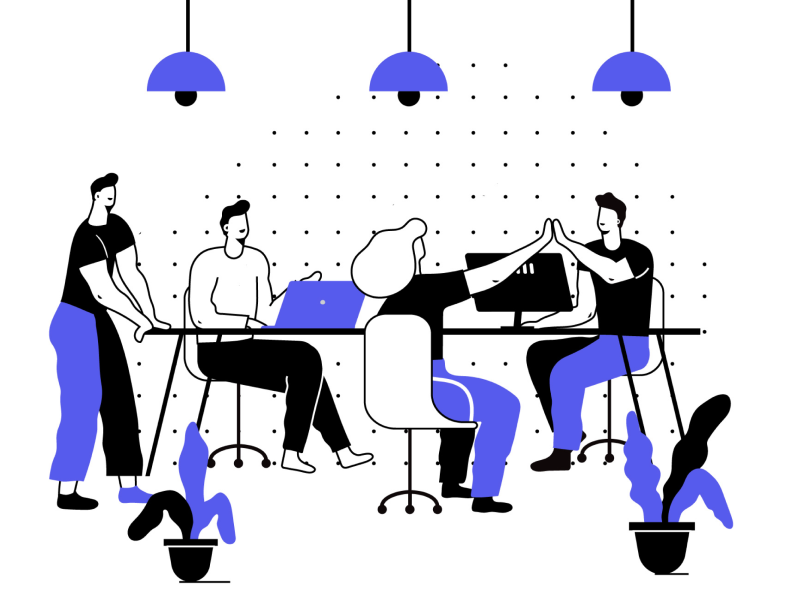
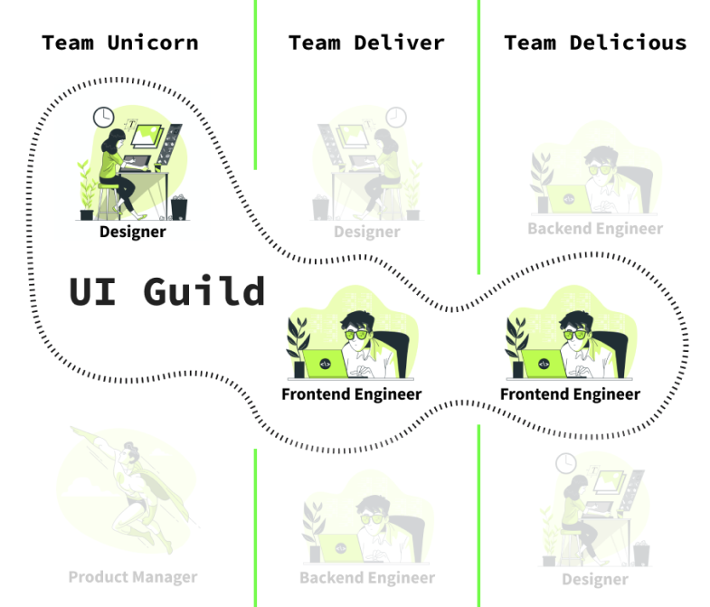

## Introduction

This guide will help **Frontend Engineers** and people from the **UI Community**
to develop a common understanding of **collaboration** and why this particular
skill can improve the process of software development and product design in your
company. I will **not** describe implementation details or how to create the
next big Design System. But I will provide you the right methods and practices
to build a pattern library or even a design system. It will also help people who
already maintain a pattern library. To point out some problems I will start with
some _storytelling_.

## The Status Quo Story

Let’s imagine ourselves in a successful company with a customer-centric
application. The company has a **product department** with a bunch of
cross-functional teams. The product designers maintain a **design library** to
align the design files, which they share with **developers** and **managers**.
Besides that, the developers maintain a **pattern library**, which provides UI
components and variables for the code in the product.

## It's not a Technical Problem

The root of all evil here is the **lack of collaboration**. It’s like they are
all aliens from different planets and everyone speaks it's **own language
(terminology)**. Yes, we’re all aliens… This is often the root cause of why
pattern libraries or design systems are failing in companies. A more common
condition is that the pattern library is initially built and maintained by a
frontend engineer. Nobody else than the frontend engineers know about the
pattern library. The maintenance condition of the pattern library is in a poor
state because of the fast-changing design library (which is maintained by the
product designers). Eventually, the developers gave up using the pattern
library, because it is not aligned with their new design files from the product
designers. Last but not least **nobody feels responsible** for maintaining the
pattern library.

Let’s sum up the problems:

- lack of terminology
- lack of interdisciplinary collaboration
- lack of responsibility

## Solution: Culture of Freedom ☮️

Everybody should have the freedom to think outside the box. We tend to end up
caught in the treadmill of **daily business**. We just do one ticket after
another. This could have a negative side effect that people aren't motivated and
productive anymore. Trust me a motivated person will add a lot of value to the
company. It should be self-evident to have that freedom in healthy company
culture. Nevertheless, the reality is sometimes different. Then you should
probably talk with your manager about it because communication can sometimes
work wonders. ✨

Regarding the problem described above this solution could be helpful for you if
you're just starting out with your goal and you need to create a solid
foundation. The main requirements for this solution are self-organization and
discipline. The crux here is to find a good balance between daily business and
your goal. Here's on way how it could work for you. Start with 1 hour per day
working on your goal. Try to stay focused and avoid distractions during that
time.

Let's sum up the requirements:

- motivation
- self-organization and discipline
- talk with your manager, if there is no culture of freedom

## Solution: Create a Guild

A guild is a group of people who are working interdisciplinary on a problem.
This kind of collaboration works particularly well with cross-team projects like
a pattern library.

The main difference is that a guild is a group of people who are **sharing the
same interests**. Those people are working **across** the whole company. Let's
take a look at this visual to get a better understanding:

The first thing you have to do is to gather people around you who are interested
in this topic and also share the same passion as you do. Most important thing is
to break the communication barriers between **Frontend Engineers** and **Product
Designers**. Once you found those people you should find a balance between
talking, listening, educating, and learning from each other. You should always
understand both sides and needs and this implied that you have to be flexible
and open-minded. The prerequisites for a well functioning guild are:

- motivation and passion
- self organization
- discipline
- people from different teams

You can now share knowledge and discuss upcoming changes or new UI components
for your pattern library. And the cool thing here is it will be aligned and
consitent across the whole product by simply using the skill of collaboration.

> Only with collaboration, we'll be able to share the same language amongst the
> company - get everyone on board and try to educate people about your pattern
> library.

## Things You Could Also Try

Once you create your well functioning guild, you can play around with some
formats:

- 🗓 schedule regular meetings
- 📋 setup a shared board (e.g Notion) to track and priotize your work
- 🖋 write documentation about the usage of your UI components
- 📣 use tools like Slack for external communcation to announce new updates
- 🌱 evangelize your pattern library or design system (e.g. do presentations)

## Conclusion

Important notice here is that things not getting easier with it, but they should
get better. Collaboration and communication are often the most difficult parts
of our jobs and you need to learn how to use those skills. By the end of the
day, nothing here is set in stone and it’s not the ideal path to success for
everyone. But I hope that these thoughts and opinions can help you to find the
ideal way for you to establish your pattern library or design system in your
company that works.

_Good luck_ 🍀
