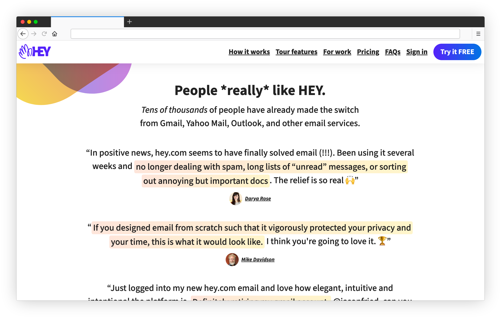
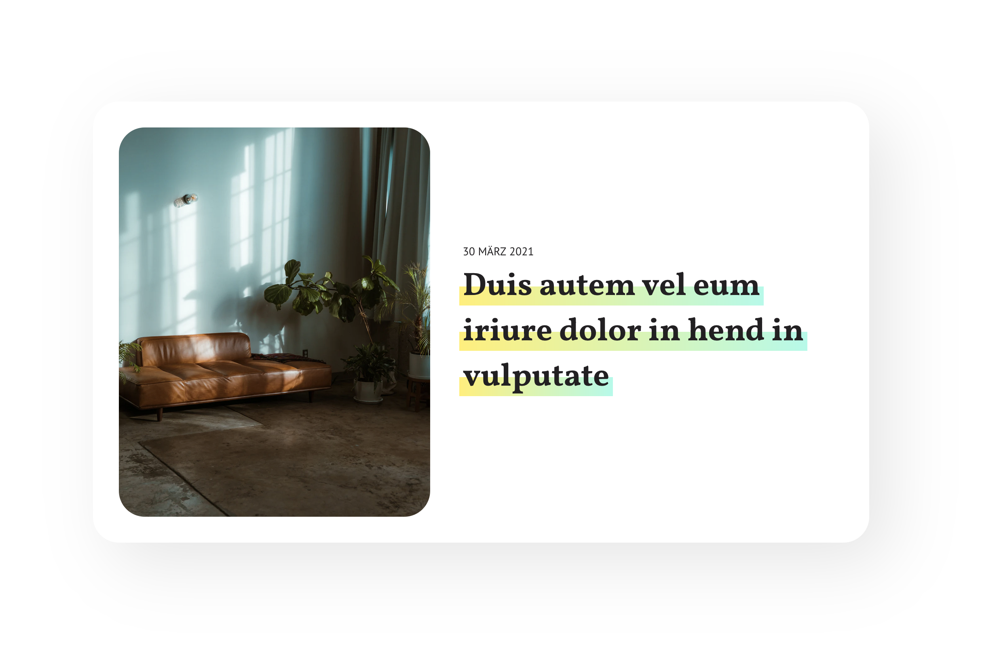

I recently stumbled across the [hey.com](https://hey.com) website 
and noticed the cool highlight effect they use for quotes. 



The effect got my attention because they decorated text across multiple lines. To be honest, 
I didn't know how to do it, so I did some research and came up with my own solution for
a simple yet beautiful card.



The trick is the CSS property **box-decoration-break**. It lets you clone some CSS properties, 
like the background or the border, to every line of the text. See [MDN](https://developer.mozilla.org/en-US/docs/Web/CSS/box-decoration-break) for details.

In my example above, I used a linear gradient and combined it with some background sizing and positioning to highlight only half of the text:

```css
.card__title {
  font-family: 'Vollkorn', serif;
  font-size: 40px;
  line-height: 1.4;
  color: #222022;
  box-decoration-break: clone;
  background-image: linear-gradient(90deg, #FFEF7E, #B7F9E9);
  background-size: 100% 42%;
  background-repeat: no-repeat;
  background-position: 0 85%;
  padding: 0 4px;
  margin-left: -4px;
}
```

The whole example is available on [Codepen](https://codepen.io/HenrikFricke/pen/GRNYrXK).

Have fun adding some extra sparkles to your website 💅🏽
